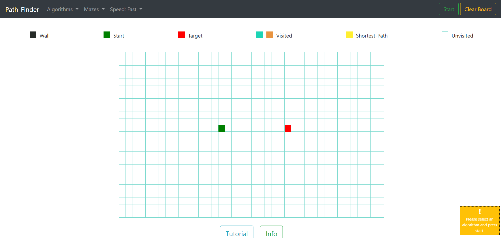
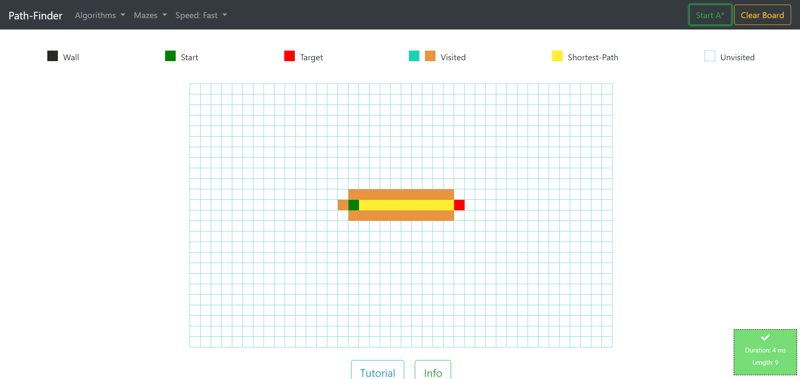
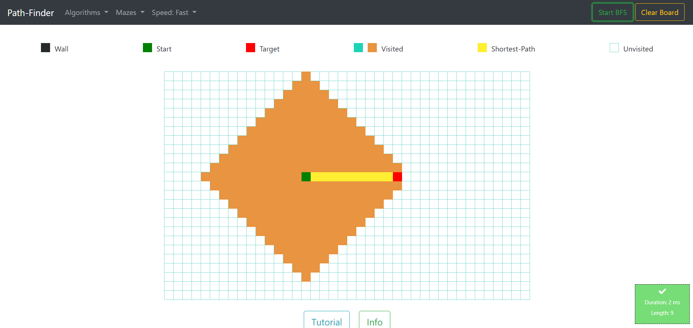

# Path-Finder

<h1 align="center">
  <br>
  <a href=""></a>
  <br>
    Path-Finder
  <br>
</h1>

<h4 align="center">An opensource Path-Finder using HTML/CSS/JS.</h4>
<br />





## 🚀Intro

**Path-Finder** is a visualizing tool that shows how different pathfinding algorithms work. The program's objective is to go from the start cell to the end cell using a pathfinding algorithm. You can draw walls by clicking or holding down the mouse over cells. Once the algorithm has found the start cell, the optimal path will be illuminated in yellow. Additionally, mazes can be generated by selecting an algorithm from the 'Mazes' tab. 


## 🚀Getting Started

#### Clone the repo

```
git clone https://github.com/meyash/Path-Finder-DS-Project-2.git
```

#### Start the application

```
run index.html
```

## 🚀License

[](/LICENSE)

By [Yashwant](https://github.com/meyash)

## 🚀Contributors

<br />

<a href="https://meyash.xyz/" style="margin-right:30px;"></a>
<a href="https://meyash.xyz/resume.pdf" style="margin-right:30px;"></a> 
<a href="https://www.linkedin.com/in/meyash21/" style="margin-right:30px;"></a>
<a href="https://twitter.com/meyash21" style="margin-right:30px;"></a>
<a href="https://www.codechef.com/users/meyash21" style="margin-right:30px;"></a>  
